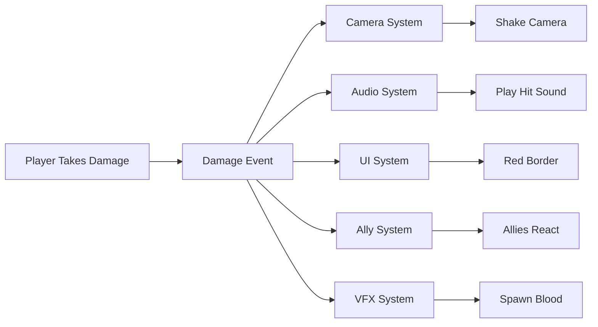

# Observer Pattern

---

## Overview

The observer pattern is one of many design patterns commonly used in game architectue. It sends out events from one class to any subscribed listeners.
In Unity this pattern is used to create decoupled systems where components can react to each other without direct references.

---

## Tutorial Video
<iframe width="560" height="315" src="https://www.youtube.com/embed/ejtV4dVET6w?si=onPdHSkgOe-gzGUw" title="YouTube video player" frameborder="0" allow="accelerometer; autoplay; clipboard-write; encrypted-media; gyroscope; picture-in-picture; web-share" referrerpolicy="strict-origin-when-cross-origin" allowfullscreen></iframe>

---

## Recommended Experience

The Observer Pattern is an early-intermediate topic and I'd consider it usually the first thing you learn how to implement when growing past the beginner stage of
game programming.

I recommend you go into this with a base understanding of:

- Connecting Multiple Systems together i.e Audio plays when the player is hurt. 
- Unity Components and Lifecycle 
- C# in Unity

---

## Using Observer Pattern

### Why Use It?

<div class="grid cards" markdown>

  - :material-access-point:{.lg .middle} __Decoupling Systems__
  
     ---
  
    Systems can exists and communicate without direct references and dependancies.

  - :material-account-group-outline: __One to Many Communication__
  
    ---
  
    A single event can notify any number of listeners i.e. Player Damage shakes the screen, plays audio and toggles a red vignette.

  - :material-tools: __Extensibility__
  
    ---
  
    More listeners can be added without modifying the original code i.e. Adding more actions to be called at the start of your boss fight. 

  - :material-bell: __Separation of Concerns__
  
    ---
  
    Listeners don't need to worry about how the data occurs, only that they recieve it and can act on it.

</div>

---

### Common Use Cases

Some common use cases for the Observer Pattern would include:

- An Experience Bar updating it's value after you defeat an enemy and gain exp.
- A cutscene triggering and the music changing at the start of a boss fight.
- The game pausing and fading to black just before a game over screen appears after running out of health.
- Music and Visual Effects playing when you open a chest.

---

### Beginner Method Replacement

The beginner method the observer pattern would replace is having hard coded references and dependencies throughout your scripts.
These can come in the form of a large number of singletons and managers, or be serialized references you have been manually assigning in the inspector yourself.
The observer pattern replaces the need for these in most cases where responsiveness isn't critical.

---

### When Not to Use the Observer Pattern

Situations where Observer Pattern may be unnecessary or overkill would be in high performance systems such as a Game Update Manager. 
Some classes are also better as singletons in the case of an Object Pool Manager. 

Events decouple code but they do have an overhead. 
When components live in the same object, opt for communication through a direct ``GetComponent<>()`` reference in Awake.

---

## Observer Pattern System Diagram

Below is a brief example of what you can quickly attach to a player damage event. Instead of needing to reference all these systems in the health class, you can instead have the classes listen in to when the player takes damage.



---

## Observer Pattern Implementation

### Code Examples

!!! tip "Simple Player Health Events"
    I will go into Unity and C# specific event architecture in further tutorials but for this intro, we just have
    a simple public event Action of type void and type int on our player health component to demonstrate how it is used. 

    We call the ``OnPlayerDamaged`` event to let the game know the players health value has been changed when taking damage. This can trigger
    damage audio, camera shake, UI Updates etc.
    
    If the damage goes below or equal to 0, we instead call the ``OnPlayerDeath`` event. This will notify the game that the player has died and can 
    call game over, a fade to black, respawn pop up, death audio, etc. 
    ```csharp
        public class PlayerHealth
        {
            public static event Action OnPlayerDeath;
            public static event Action<int> OnPlayerDamaged;
    
            private int _currentHealth;
    
            public void TakeDamage(int amount)
            {
                _currentHealth -= amount;
    
                if(currentHealth > 0)
                    OnPlayerDamaged?.Invoke(_currentHealth);
                else
                    OnPlayerDeath?.Invoke();
            }
        }
    ```

!!! tip "User Interface Manager"
    Our interface subscribes to our player events so it knowns what value to update the healtbar to,
    and to display the game over screen if the player dies. We have our functions declared in the class.
    To call these functions through events, we need to subscribe them to the events in ``OnEnable()`` and `OnDisable()`.

    Since the Damaged event passes through an ``int`` variable. Our handler function needs to take an ``int`` as a reference.
    Since the death event is just a void. It does not. Below is a basic Unity implementation.
    
    ```csharp
    public class UserInterfaceManager
    {
        private Slider _healthBar;
        private CanvasGroup _gameOver;
    
        private void UpdateSlider(int newHp)
        {
            _healthBar.value = newHp;
        }
    
        private void ShowGameOver()
        {
            _gameOver.alpa = 1;
        }
    
        private void OnEnable()
        {
            PlayerHealth.OnPlayerDamaged += UpdateSlider;
            PlayerHealth.OnPlayerDeath += ShowGameOver;
        }
    
        private void OnDisable()
        {
            PlayerHealth.OnPlayerDamaged -= UpdateSlider;
            PlayerHealth.OnPlayerDeath -= ShowGameOver;
        }
    
    }
    ```

---

## Final Thoughts

Once you get comfortable working with Delegates and Events, developing a solid understanding of the observer pattern. 
You'll be capable of developing better structured and scalable systems for your games, opening up many new possibilities.

This was just a basic intro, we will go into Scriptable Object Event Channels and C# Event Channels next.
These are two very common and well structured methods of implementing the observer pattern in Unity.

---