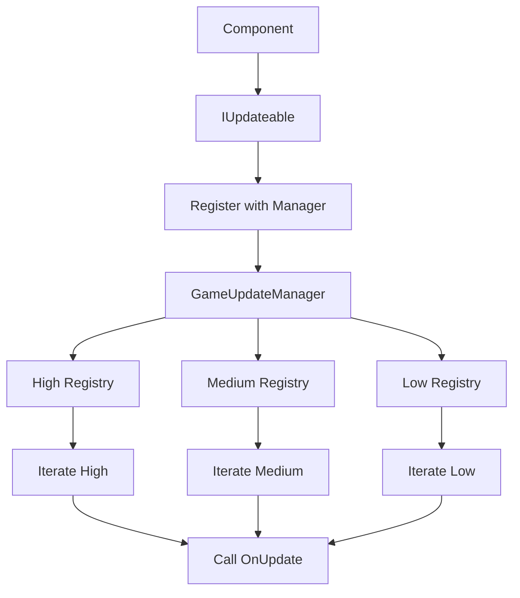

# Game Update Manager

---

## Overview

A Custom Game Update Manager is a common design choice in intermediate - large sized games that have hundreds
or thousands of objects calling `Update()` each frame. It allows us to remove the overhead from the
Unity base `Update()` and set different update priority tiers so everything doesn't need to be called
each frame.

---

## Tutorial Video

Tutorial video for **Game Update Manager**.

---

## Recommended Experience

I would consider the Custom Update Manager to be an Intermediate topic in Unity.

Its implementation is very straight forward, but it requires an understanding of some basic concepts and 
isn't necessary on smaller scale beginner projects. 

I recommend you go into this with a base understanding of:

- C# Interfaces
- Unities Lifecycle Calls ie. ``Update()``, ``FixedUpdate()``, ``LateUpdate()``
- Understanding of memory Allocation and De-Allocation with ``OnEnable()`` and ``OnDisable()``
- Understanding of the Singleton Pattern and how Instances work

---

## Using a Custom Game Update Manager

### Why Use One?

<div class="grid cards" markdown>

-   :material-clock-fast:{.lg .middle} __Performance__
    
    ---
    
    Less overhead than the base ``Update()`` call which saves CPU Performance.
  

-     :material-priority-high: __Prioritisation__
    
      ---
    
      Specify how often ``Update()`` needs to be called in each script.


-   :material-cached: __Cache Efficiency__
    
      ---
    
      Groups similar priority updates together compared to ``Update()`` being scattered across
    multiple components.

  -   :octicons-bug-16: __Debugging and Profiling__

      ---

      Centralised update logic makes it easier to debug and profile performance

</div>

---

### Common Use Cases

Some common use cases for a Custom Update Manager would include:

- Mobile, VR and XR Games where CPU optimization and performance is critical.
- Games with hundreds of active entities such as a Tower Defence or RTS Game.
- A City Builder game with hundreds of update calls for NPC's, vehicles and buildings.

---

### Beginner Method Replacement

The beginner-friendly approach that **Game Update Manager** replaces would just be using
the Unity MonoBehaviour ``Update()`` for every component in the game. 

---

### When Not to Use Game Update Manager

Situations where **Game Update Manager** may be unnecessary or overkill would be for small projects
or rapid prototypes. The overhead is negligible unless Update is being called on many different components.

---

## Game Update Manager System Diagram

Here you can see the flow of how the system works. The key feature of an Update Manager is
the Update Priority which you define when registering.



---

## Game Update Manager Code

### Code Examples

!!! tip "IUpdateable Interface"
    Here we have the interface that Components inherit so they can have access to the
    ``OnUpdate()`` method.
    ```csharp
    public interface IUpdateable()
    {
        public void OnUpdate(float deltaTime);
    }
    ```

!!! tip "Update Priority Enum"
    We create an Update Priority enum so we can safely separate our components into lists to be
    called at their set rate. This is passed through when registering so the component can be
    added to the related list.
    ```csharp
    public enum UpdatePriority
    {
        Low,
        Medium,
        High
    }
    ```

!!! tip "Game Update Manager"
    Here we have the main manager file which is a singleton that handles registering,
    unregistering, and updating every component that uses the ``IUpdateable`` interface.
    ```csharp
        public class GameUpdateManager : MonoBehaviour
        {
            public static GameUpdateManager Instance { get; private set; }
            
            private readonly List<IUpdateable> _highPriorityUpdates = new();
            private readonly List<IUpdateable> _mediumPriorityUpdates = new(); 
            private readonly List<IUpdateable> _lowPriorityUpdates = new();
    
            private const float MediumPriorityInterval = 0.2f;
            private const float LowPriorityInterval = 0.4f;
            private float _mediumPriorityTimer;
            private float _lowPriorityTimer;
    
            private void UpdateHighPriority()
            {
                for (var i = 0; i < _highPriorityUpdates.Count; i++)
                {
                    _highPriorityUpdates[i].OnUpdate(Time.deltaTime);
                }
            }
    
            private void UpdateMediumPriority()
            {
                _mediumPriorityTimer += Time.deltaTime;
                if (!(_mediumPriorityTimer >= MediumPriorityInterval)) return;
                
                for (var i = 0; i < _mediumPriorityUpdates.Count; i++)
                {
                    _mediumPriorityUpdates[i].OnUpdate(_mediumPriorityTimer);
                }
                _mediumPriorityTimer = 0f;
            }
    
            private void UpdateLowPriority()
            {
                _lowPriorityTimer += Time.deltaTime;
                if (!(_lowPriorityTimer >= LowPriorityInterval)) return;
                
                for (var i = 0; i < _lowPriorityUpdates.Count; i++)
                {
                    _lowPriorityUpdates[i].OnUpdate(_lowPriorityTimer);
                }
                _lowPriorityTimer = 0f;
            }

            public void Register(IUpdateable updateable, UpdatePriority priority)
            {
                switch (priority)
                {
                    case UpdatePriority.High:
                        _highPriorityUpdates.Add(updateable);
                        break;
                    case UpdatePriority.Medium:
                        _mediumPriorityUpdates.Add(updateable);
                        break;
                    case UpdatePriority.Low:
                        _lowPriorityUpdates.Add(updateable);
                        break;
                    default:
                        throw new ArgumentOutOfRangeException(nameof(priority), priority, null);
                }
            }
            
            public void Unregister(IUpdateable updateable)
            {
                if (_highPriorityUpdates.Remove(updateable)) return;
                if (_mediumPriorityUpdates.Remove(updateable)) return;
                _lowPriorityUpdates.Remove(updateable);
            }
            
            private void Awake()
            {
                if (Instance != null && Instance != this)
                {
                    Destroy(gameObject);
                    return;
                }
                
                Instance = this;
            }
            
            private void Update()
            {
                UpdateHighPriority();
                UpdateMediumPriority();
                UpdateLowPriority();
            }
        }
    ```

### Tutorial Video Source Files

- [GameUpdateManager](#)
- [IUpdateable](#)
- [UpdatePriority](#)
- [DemoController](#)

---

## Final Thoughts

Once you get the hang of using your own custom **Game Update Manager**, it becomes very
fast and easy to implement. It's a nice way to learn how to start doing your own thing
in an engine like Unity where things are made very easy for you in places. 
That does not mean they are made optimally though and this is just one of a few tricks
professional studios use to squeeze as much performance as they can out of it.

---
