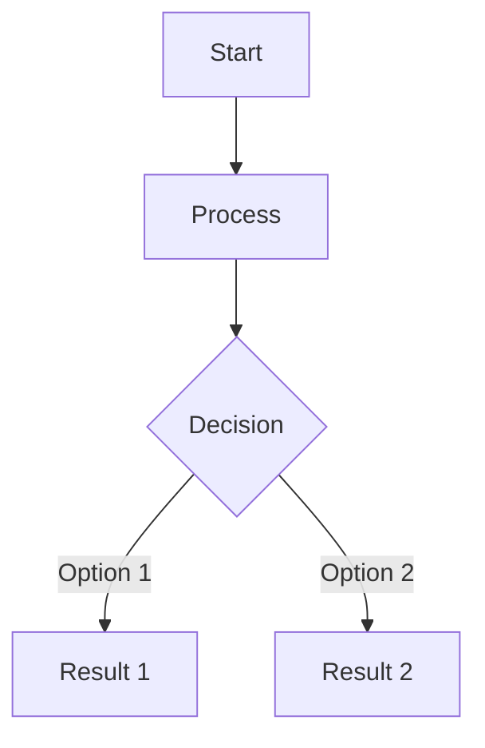

# [Topic Name]

---

## Overview

[Brief introduction to the topic. Explain what it is, what problem it solves, and why it's relevant in Unity game development. Keep it concise and engaging.]

---

## Tutorial Video

<iframe width="560" height="315" src="https://www.youtube.com/embed/VIDEO_ID_HERE" title="YouTube video player" frameborder="0" allow="accelerometer; autoplay; clipboard-write; encrypted-media; gyroscope; picture-in-picture; web-share" referrerpolicy="strict-origin-when-cross-origin" allowfullscreen></iframe>

---

## Recommended Experience

[Describe the recommended skill level for this tutorial. Mention any prerequisite knowledge or concepts the viewer should be familiar with. Be specific about what they should understand beforehand.]

I recommend you go into this with a base understanding of:

- [Prerequisite Concept 1]
- [Prerequisite Concept 2]
- [Prerequisite Concept 3]

---

## Using [Topic Name]

### Why Use It?

<div class="grid cards" markdown>

-   :material-icon-name:{.lg .middle} __Benefit 1__

    ---

    [Explanation of benefit 1]


-   :material-icon-name: __Benefit 2__

    ---

    [Explanation of benefit 2]


-   :material-icon-name: __Benefit 3__

    ---

    [Explanation of benefit 3]

-   :material-icon-name: __Benefit 4__

    ---

    [Explanation of benefit 4]

</div>

---

### Common Use Cases

Some common use cases for [Topic Name] would include:

- [Use case 1]
- [Use case 2]
- [Use case 3]

---

### Alternative Approaches

[Describe what common/basic approach this system replaces or improves upon. Explain why the basic approach might be insufficient.]

---

### When Not to Use [Topic Name]

Situations where [Topic Name] may be unnecessary or overkill would be:

- [Situation 1]
- [Situation 2]

---

## [Topic Name] System Diagram

[Brief description of the diagram below]



---

## [Topic Name] Implementation

### Code Examples

!!! tip "[Key Component 1]"
[Brief description of what this code does]
```csharp
// Example code here
public class ExampleClass
{
    public void ExampleMethod()
    {
        // Implementation
    }
}
```

!!! tip "[Key Component 2]"
[Brief description of what this code does]
```csharp
// Example code here
public class AnotherClass
{
    public void AnotherMethod()
    {
        // Implementation
    }
}
```

!!! tip "[Key Component 3]"
[Brief description of what this code does]
```csharp
// Example code here
public class MainManager : MonoBehaviour
{
    // Implementation
}
```

### Tutorial Video Source Files

- [Main Script](https://github.com/username/repository/blob/main/path/to/script.cs)
- [Supporting Script 1](https://github.com/username/repository/blob/main/path/to/script2.cs)
- [Supporting Script 2](https://github.com/username/repository/blob/main/path/to/script3.cs)

---

## Final Thoughts

[Concluding thoughts about the topic. Mention key takeaways, practical applications, or how it fits into larger game development practices. Keep it encouraging and forward-looking.]

---

## Additional Resources

- [Related Documentation Link 1]
- [Related Documentation Link 2]
- [Community Forum/Discussion Link]

---

**Template Instructions:**
1. Replace all `[bracketed text]` with your specific content
2. Update video ID in iframe src
3. Add or remove benefit cards as needed
4. Customize the Mermaid diagram for your specific system
5. Update GitHub links to your actual repository
6. Add/remove code example sections as needed
7. Fill in prerequisites with actual required knowledge
8. Update material icons from Material Design Icons library